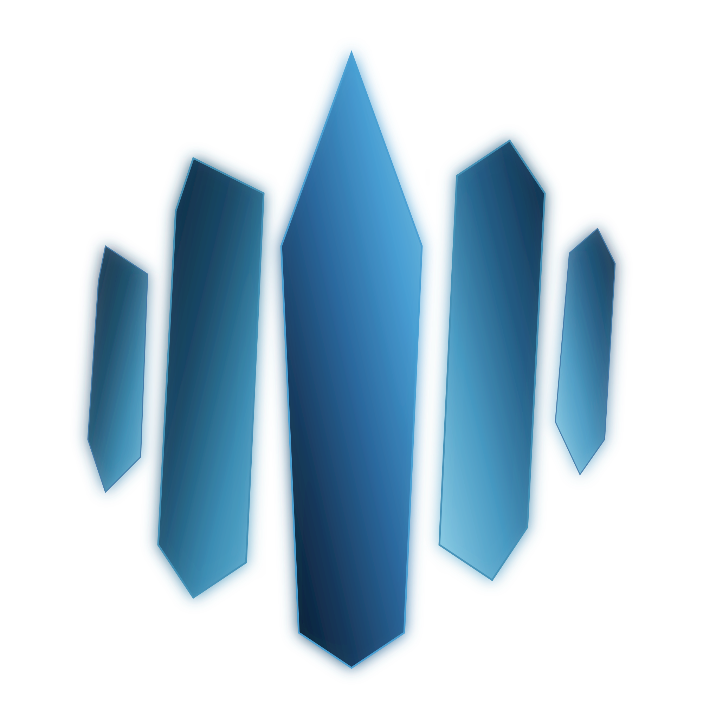

# Kyanite

Kyanite is a custom bootable container based on Fedora Kinoite, borrowing heavily from the [Universal Blue](https://universal-blue.org/) project. Provides a clean KDE Plasma desktop with essential development tools, container support, and hardware optimizations.



Kyanite is built on Universal Blue's [kinoite-main](https://github.com/ublue-os/main) image, which itself derives from Fedora Kinoite with additional batteries included.

## Variant System

Kyanite uses a flexible variant system where you can combine features using hyphen-separated names:

**Available Variants:**

- **kyanite** (main) - Clean KDE Plasma desktop for general use and development
- **kyanite-gaming** - Adds Steam, Gamescope, GameMode, MangoHud, and Sunshine
- **Combined variants** - Mix and match features (e.g., `kyanite-gaming-dx-nvidia`)

Each variant is defined declaratively in JSON configuration files:

- **Packages** → `packages.json` defines what gets installed
- **Services** → `services.json` defines what gets enabled
- **Files** → `files/{variant}/` directories contain variant-specific system files
- **Branding** → KDE About dialog shows which variants are active (e.g., "GAMING+DX")

**Note:** Only `main` and `gaming` variants are currently built in CI. To use combined or custom variants, you'll need to build locally with `IMAGE_FLAVOR=gaming-dx just build`.

## Quick Start

### Install Kyanite

Switch from any bootc or OSTree-based system:

```bash
# Standard variant
sudo bootc switch ghcr.io/alyraffauf/kyanite:stable
sudo systemctl reboot

# Gaming variant
sudo bootc switch ghcr.io/alyraffauf/kyanite-gaming:stable
sudo systemctl reboot
```

### Switch Between Variants

```bash
# To gaming
sudo bootc switch ghcr.io/alyraffauf/kyanite-gaming:stable

# To standard
sudo bootc switch ghcr.io/alyraffauf/kyanite:stable
```

### First Boot

After installation, Kyanite automatically installs configured Flatpaks and enables Docker, Podman, and Tailscale. Explore available commands:

```bash
ujust --list
```

## What's Included

### Development & Containers

- **Docker CE** - Full Docker with compose and buildx plugins
- **Podman** - Rootless containers with compose support
- **Fish Shell** - Modern, user-friendly shell

### Virtualization

- **QEMU/KVM** - Full virtualization stack with libvirt
- **AMD ROCm** - GPU compute support for AMD graphics

### Networking & Sync

- **Tailscale** - Zero-config VPN (pre-installed and enabled)
- **Syncthing** - Continuous file synchronization

### Desktop

- **Ptyxis** - Modern terminal emulator
- **Cider** - Apple Music client
- **Dynamic Wallpapers** - Time-based wallpaper transitions
- **Audio Enhancements** - Professional-grade PipeWire plugins

### Gaming Variant Additions

- Steam, Gamescope, GameMode, MangoHud, Sunshine

### Removed Bloat

Firefox (replaced with Flathub Flatpak), Akonadi, Plasma Discover, and other unwanted defaults. Use Flatpak for browsers and apps.

## Customization

### System Packages (Build-Time)

Edit [`packages.json`](packages.json) to add common packages or variant-specific packages:

```json
{
    "include": ["vim", "htop"],
    "exclude": ["unwanted-package"],
    "variants": {
        "gaming": {
            "include": ["steam", "gamescope"],
            "exclude": []
        },
        "dx": {
            "include": ["gcc", "make"],
            "exclude": []
        }
    }
}
```

### System Services (Build-Time)

Edit [`services.json`](services.json) to configure systemd units:

```json
{
    "system": {
        "enable": ["docker.socket"],
        "disable": []
    },
    "variants": {
        "gaming": {
            "system": {
                "disable": ["sunshine.service"]
            }
        }
    }
}
```

### Third-Party Software (Build-Time)

Add to [`build/25-third-party-packages.sh`](build/25-third-party-packages.sh). See existing examples for Docker, Cider, and Tailscale.

### Variant-Specific Files (Build-Time)

Place files in `files/{variant}/` directories:

- `files/shared/` - Copied to all variants
- `files/main/` - Only copied when building main variant
- `files/gaming/` - Only copied when building gaming variant
- `files/dx/` - Only copied when building dx variant (if created)

### Runtime Applications

- **Homebrew** - Add packages to Brewfiles in [`custom/brew/`](custom/brew/)
- **Flatpak** - Add to `.preinstall` files in [`custom/flatpaks/`](custom/flatpaks/)
- **Commands** - Create ujust shortcuts in [`custom/ujust/`](custom/ujust/)

## Building Locally

### Prerequisites

- [Podman](https://podman.io/) installed
- [Just](https://just.systems/) command runner
- Sufficient disk space (~20GB for container builds, ~10GB additional for ISOs)

### Build the OCI Container Image

The container image is the base for all other build artifacts:

```bash
# Build standard variant
just build

# Build gaming variant
IMAGE_FLAVOR=gaming just build

# Build combined variants
IMAGE_FLAVOR=gaming-dx just build
IMAGE_FLAVOR=dx-gaming-nvidia just build

# Build with custom tag
just build localhost/kyanite mytag
```

This creates a local container image at `localhost/kyanite:stable` (or `localhost/kyanite-gaming:stable` for the gaming variant).

### Build with a Different Base Image

You can override the base image at build time using environment variables:

```bash
# Get the SHA for the image you want to use
BASE_IMAGE_SHA=$(skopeo inspect docker://ghcr.io/ublue-os/kinoite-nvidia:latest --format '{{.Digest}}')

# Build with NVIDIA drivers pre-installed
BASE_IMAGE=ghcr.io/ublue-os/kinoite-nvidia:latest \
BASE_IMAGE_SHA=$BASE_IMAGE_SHA \
just build

# Combined with flavor variants
BASE_IMAGE=ghcr.io/ublue-os/kinoite-nvidia:latest \
BASE_IMAGE_SHA=$BASE_IMAGE_SHA \
IMAGE_FLAVOR=gaming \
just build
```

This is useful for building Kyanite on top of other Universal Blue variants with support for your hardware.

### Build Bootable Images

Once you have the OCI container, you can create bootable images using [Bootc Image Builder](https://github.com/osbuild/bootc-image-builder):

```bash
# Build QCOW2 (for QEMU/KVM virtualization)
just build-qcow2

# Build RAW disk image
just build-raw

# Build ISO installer
just build-iso
```

Output files are placed in the `output/` directory:

- `output/qcow2/disk.qcow2` - QCOW2 virtual disk
- `output/raw/disk.raw` - RAW disk image
- `output/bootiso/install.iso` - Bootable ISO installer

### Test in a Virtual Machine

```bash
# Build and run QCOW2 in browser-based VM
just build-qcow2
just run-vm-qcow2

# Gaming variant
IMAGE_FLAVOR=gaming just build-qcow2
IMAGE_FLAVOR=gaming just run-vm-qcow2

# Combined variants
IMAGE_FLAVOR=gaming-dx just build-qcow2
IMAGE_FLAVOR=gaming-dx just run-vm-qcow2
```

### Rebuild Commands

Use rebuild commands to force a fresh container build before creating bootable images:

```bash
just rebuild-qcow2
just rebuild-raw
just rebuild-iso
```

## Development Workflow

1. Fork and create a feature branch
2. Make changes and open a pull request
3. Automated validation runs (shellcheck, YAML, Brewfile, Flatpak)
4. Merge to `main` triggers `:stable` builds

## Security

All images are cryptographically signed with [Sigstore Cosign](https://github.com/sigstore/cosign) using keyless signing (GitHub OIDC). Renovate automatically updates dependencies.

### Verify Signatures

```bash
cosign verify \
  --certificate-identity-regexp="https://github.com/alyraffauf/kyanite/.*" \
  --certificate-oidc-issuer=https://token.actions.githubusercontent.com \
  ghcr.io/alyraffauf/kyanite:stable
```

### Use Signed Transport

```bash
# Switch to signed registry
sudo rpm-ostree rebase ostree-image-signed:docker://ghcr.io/alyraffauf/kyanite:stable
sudo systemctl reboot

# Verify
rpm-ostree status  # Should show "ostree-image-signed:" prefix
```

## Adding New Variants

To add a new variant (e.g., "dx" for developer experience):

1. **Add packages** to `packages.json`:

    ```json
    "variants": {
      "dx": {
        "include": ["gcc", "make", "git-lfs"],
        "exclude": []
      }
    }
    ```

2. **Add services** to `services.json`:

    ```json
    "variants": {
      "dx": {
        "system": {"enable": ["some-service.service"], "disable": []}
      }
    }
    ```

3. **Add files** (optional) in `files/dx/` directory

4. **Build**: `IMAGE_FLAVOR=dx just build`

The variant will be automatically detected and:

- Packages from `variants.dx.include` will be installed
- Services from `variants.dx.system.enable` will be enabled
- Files from `files/dx/` will be copied
- KDE About will show "Variant=DX"

You can also combine it: `IMAGE_FLAVOR=gaming-dx just build` installs both gaming and dx packages!

## Documentation

- **[AGENTS.md](AGENTS.md)** - Comprehensive build guide and agent instructions
- **[BUILD.md](BUILD.md)** - Build system architecture details
- **[custom/brew/](custom/brew/)** - Homebrew package management
- **[custom/flatpaks/](custom/flatpaks/)** - Flatpak configuration
- **[custom/ujust/](custom/ujust/)** - User commands
- **[packages.json](packages.json)** - Package definitions
- **[services.json](services.json)** - Service configurations

## Resources

- [Universal Blue](https://universal-blue.org/) - Learn about the ecosystem
- [bootc Documentation](https://containers.github.io/bootc/) - Container-native OS architecture
- [Universal Blue Discord](https://discord.gg/WEu6BdFEtp) - Community support

## License

Apache License 2.0 - See [LICENSE](LICENSE)

## Acknowledgments

Built with [Universal Blue](https://universal-blue.org/) tooling and infrastructure. Based on [Fedora Kinoite](https://fedoraproject.org/kinoite/) with [KDE Plasma](https://kde.org/). Powered by [bootc](https://containers.github.io/bootc/).
