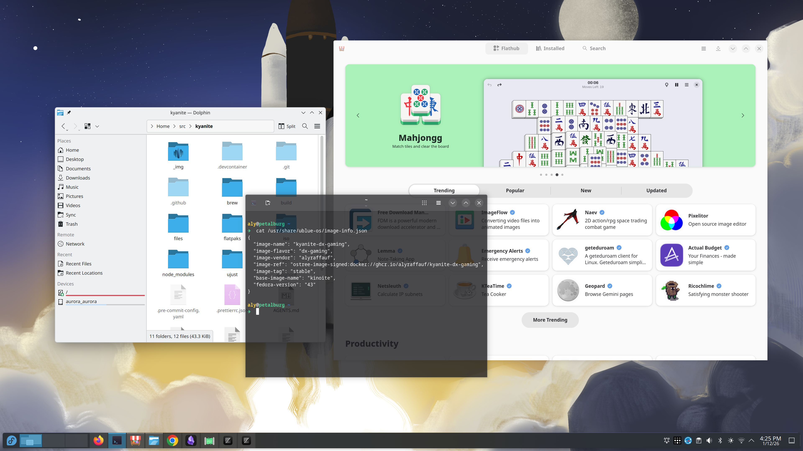

# Kyanite

A Fedora Kinoite spin I run as my daily driver. KDE Plasma, no corporate branding, rough edges sanded off.



## What's different from stock Kinoite

- Firefox via Mozilla's official Flatpak; Bazaar in place of Discover.
- Flathub set up on first boot; Fedora's flatpak remotes removed.
- Fish as the default shell, dynamic wallpapers, fcitx5 for CJK input.
- Fuller codec stack via [negativo17](https://negativo17.org/) — h264/h265/AV1 playback just works.
- Heavy stuff (Docker, virt, Steam, ROCm, etc.) lives in [sysexts](#optional-sysexts) instead of the base image.
- PipeWire filter chains for some laptop speaker DSP setups.
- Ollama Quadlets ready to go for local LLMs on CPU, ROCm, or Vulkan.

I borrow the [ujust](https://github.com/ublue-os/packages/tree/main/packages/ublue-os-just) command framework and a couple of utility packages from Universal Blue's COPR, but everything else is built straight on Fedora Kinoite.

## Quick Start

If you're on a bootc system already (Kinoite, Aurora, etc.):

```bash
sudo bootc switch ghcr.io/alyraffauf/kyanite:stable
sudo systemctl reboot
```

After it boots, `ujust --list` shows what custom recipes are available. A couple things to know up front: stuff under `/etc/skel` doesn't auto-migrate, and rebasing across desktop environments (e.g. GNOME → KDE) usually goes badly.

## Optional sysexts

Anything heavy or opt-in lives in [kyanite-sysexts](https://github.com/alyraffauf/kyanite-sysexts) as systemd-sysext payloads. Install only what you actually want:

| Sysext      | What you get                                                |
| ----------- | ----------------------------------------------------------- |
| `docker`    | Docker CE + buildx, compose, model plugins                  |
| `rocm`      | AMD ROCm, HIP, OpenCL, rocm-smi                             |
| `steam`     | Native Steam, Gamescope, MangoHud, GameMode (i686 multilib) |
| `syncthing` | Native Syncthing daemon                                     |
| `tailscale` | Tailscale mesh-VPN client + daemon                          |
| `virt`      | QEMU/KVM, libvirt, edk2-ovmf, virtio drivers                |

```bash
ujust install-sysext NAME
ujust remove-sysext NAME
```

They auto-update via `systemd-sysupdate.timer`. Gaming launchers (Heroic, ProtonUp-Qt, Lutris) ship as Flatpaks — `ujust install-gaming-flatpaks`.

## Local LLMs (Ollama)

Three Quadlet units for running [Ollama](https://ollama.com/) as a user-level systemd service. The GPU runtimes live inside the container, so you don't have to install ROCm or Vulkan ICDs on the host.

```bash
ujust enable-ollama          # CPU (or NVIDIA on a kinoite-nvidia base)
ujust enable-ollama-rocm     # AMD GPU via ROCm. Run configure-gpu-groups first.
ujust enable-ollama-vulkan   # AMD GPU via Vulkan. Works on cards ROCm doesn't.
```

All three listen on `127.0.0.1:11434` and share the `ollama-data` volume, so model weights don't redownload when you switch backends. They're mutually exclusive: starting one stops the others.

Start with `ollama-rocm` if you have an officially-supported AMD card (RDNA1/2 high-end, RDNA3, CDNA). If `ollama list` shows your model running on CPU, your card isn't in the bundled rocBLAS — switch to Vulkan.

## Syncthing

```bash
ujust install-sysext syncthing
systemctl --user enable --now syncthing.service
```

GUI at `http://127.0.0.1:8384`. Existing config in `~/.local/state/syncthing/` carries over (peer devices, folder lists, etc.).

> Coming from the old containerized Quadlet setup? Run `ujust remove-syncthing-quadlet` first to clean up.

## Quadlets

Templates ship at `/usr/share/kyanite/quadlets/`. The `ujust enable-X` recipes copy a template into `~/.config/containers/systemd/` so OS updates won't clobber your edits. To customize (e.g. uncomment `HSA_OVERRIDE_GFX_VERSION` in `ollama-rocm.container`), edit your user copy, then:

```bash
systemctl --user daemon-reload
systemctl --user restart <service>
```

`podman-auto-update.timer` is on by default, so any quadlet with `AutoUpdate=registry` (all of mine) refreshes nightly.

## Customization & forking

The configuration is declarative — fork it and edit a few JSON files:

- [`packages.json`](packages.json) — packages per variant (`include` / `exclude`)
- [`services.json`](services.json) — systemd units to enable at build time
- `files/<variant>/` — variant-specific system files (only `main/` is populated)
- [`brew/`](brew/) — Homebrew bundles installed at runtime via `ujust install-*`
- [`flatpaks/`](flatpaks/) — Flatpaks preinstalled on first boot
- [`ujust/`](ujust/) — custom ujust recipes

The variant scaffold (`packages.json variants.{name}`, `IMAGE_FLAVOR=NAME` in CI) is still wired up even though I only build `kyanite` now. Flipping a CI switch can revive `dx` or any other variant.

## Building locally

Needs [Podman](https://podman.io/) and [Just](https://just.systems/):

```bash
just build           # build the kyanite container
just build-qcow2     # build a qcow2 for VM testing
just build-iso       # ~10GB, takes 30+ min
just run-vm          # boot the qcow2 in qemu
```

The shared desktop assets come from the digest-pinned
[`kyanite-common`](https://github.com/alyraffauf/kyanite-common) OCI layer.
For local common-layer development, build it first and pass its local digest:

```bash
COMMON_IMAGE=localhost/kyanite-common:stable \
COMMON_IMAGE_SHA=$(podman image inspect localhost/kyanite-common:stable --format '{{.Digest}}') \
just build
```

NVIDIA base experiment:

```bash
BASE_IMAGE=ghcr.io/ublue-os/kinoite-nvidia:latest \
BASE_IMAGE_SHA=$(skopeo inspect docker://$BASE_IMAGE --format '{{.Digest}}') \
just build
```

Output lands in `output/`. I don't publish pre-built ISOs — install Fedora Kinoite and rebase, or build one yourself.

## Security

Images are signed with [cosign](https://github.com/sigstore/cosign) against [`cosign.pub`](./cosign.pub):

```bash
cosign verify \
  --key https://raw.githubusercontent.com/alyraffauf/kyanite/main/cosign.pub \
  ghcr.io/alyraffauf/kyanite:stable
```

### Switching to signed transport

`ostree-image-signed:` only works once the running deployment ships kyanite's `policy.json` and `cosign.pub`. A fresh switch from non-kyanite is a two-step bootstrap:

```bash
# 1. Unsigned switch — gets you a deployment with the policy + key.
sudo bootc switch ghcr.io/alyraffauf/kyanite:stable
sudo systemctl reboot

# 2. After reboot, switch the tracker to signed.
sudo rpm-ostree rebase ostree-image-signed:docker://ghcr.io/alyraffauf/kyanite:stable
sudo systemctl reboot
```

After step 2, `rpm-ostreed-automatic.timer` (on by default) verifies every pulled image against `cosign.pub` before any bytes touch your filesystem. `rpm-ostree status` should show `ostree-image-signed:` as the booted spec.

## State of things

It works well enough for me to use daily. Despite the rename, plenty of Fedora visual branding is still around (Kickoff logo, fastfetch, wallpapers). This is intended to be a very light repackage.

## Resources

- [kyanite-sysexts](https://github.com/alyraffauf/kyanite-sysexts) — the sysexts repo
- [Universal Blue](https://universal-blue.org/) — the project I borrow ideas (and a few packages) from
- [bootc docs](https://containers.github.io/bootc/) — the cloud-native OS layer underneath

## License

Apache 2.0. See [LICENSE.md](LICENSE.md). Based on [Fedora Kinoite](https://fedoraproject.org/kinoite/) with [KDE Plasma](https://kde.org/), inspired by [Universal Blue](https://universal-blue.org/).
